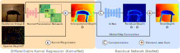
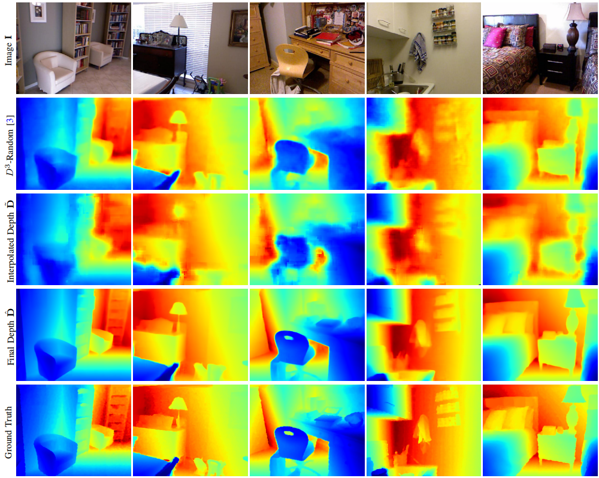

# Learning Steering Kernels for Guided Depth Completion

##### This is the official PyTorch implementation of the paper [Learning Steering Kernels for Guided Depth Completion](http://www.cvlibs.net/publications/Liu2021TIP.pdf), TIP 2021, Lina Liu, Yiyi Liao, Yue Wang, Andreas Geiger and Yong Liu.

## Citation

If you find our work useful in your research please consider citing our paper:

```
@ARTICLE{liu2021learning,  
    author={Liu, Lina and Liao, Yiyi and Wang, Yue and Geiger, Andreas and Liu, Yong},  
    journal={IEEE Transactions on Image Processing},   
    title={Learning Steering Kernels for Guided Depth Completion},   
    year={2021},  
    volume={30},  
    number={},  
    pages={2850-2861},  
    doi={10.1109/TIP.2021.3055629}}
}

```

## Introduction

This paper addresses the guided depth completion task in which the goal is to predict a dense depth map given a guidance 
RGB image and sparse depth measurements. Recent advances on this problem nurture hopes that one day we can
acquire accurate and dense depth at a very low cost. A major challenge of guided depth completion is to effectively make use
of extremely sparse measurements, e.g., measurements covering less than 1% of the image pixels. In this paper, we propose
a fully differentiable model that avoids convolving on sparse tensors by jointly learning depth interpolation and refinement.
More specifically, we propose a differentiable kernel regression layer that interpolates the sparse depth measurements via learned
kernels. We further refine the interpolated depth map using a residual depth refinement layer which leads to improved
performance compared to learning absolute depth prediction using a vanilla network. We provide experimental evidence that
our differentiable kernel regression layer not only enables endto-end training from very sparse measurements using standard
convolutional network architectures, but also leads to better depth interpolation results compared to existing heuristically
motivated methods. We demonstrate that our method outperforms many state-of-the-art guided depth completion techniques
on both NYUv2 and KITTI. We further show the generalization ability of our method with respect to the density and spatial
statistics of the sparse depth measurements.

**The following is an overview of our network architecture.**



**The qualitative comparison on NYUDv2 are shown as follows.**




## Usage

#### Requirements

Assuming a fresh Anaconda distribution with Python 3.5, you can install the dependencies with:

```
conda install pytorch=0.3.0 torchvision=0.2.0 cuda90 -c pytorch
conda install scipy
conda install matplotlib
conda install scikit-image
pip install opencv-python==4.1.0.25
pip install tensorboardX
pip install pandas  
pip install h5py
```

Then, use the following command to compile the shared object file for kernel regression:

```
sh build_cuda.sh
```


#### Datasets

This code is tested on NYU dataset. We use the same preprocessed NYU dataset as [CSPN](https://github.com/XinJCheng/CSPN/tree/master/cspn_pytorch).

```
mkdir data; cd data
wget http://datasets.lids.mit.edu/sparse-to-dense/data/nyudepthv2.tar.gz
tar -xvf nyudepthv2.tar.gz && rm -f nyudepthv2.tar.gz
mv nyudepthv2 nyudepth_hdf5
```


#### Pretrained Models

The pretrained KernelNet model and ResNet model can be [Downloaded](https://drive.google.com/drive/folders/1MAlkT68A3PegiexINhBqLPoqp0A3qvxn?usp=sharing).


#### Evaluation on NYU

Use the following command to evaluate the trained network on NYU test data.
```
python val.py --model "resnet_model.pth" --data_dir "the path of NYU dataset" --loadref "kernelnet_model.pth"
```


